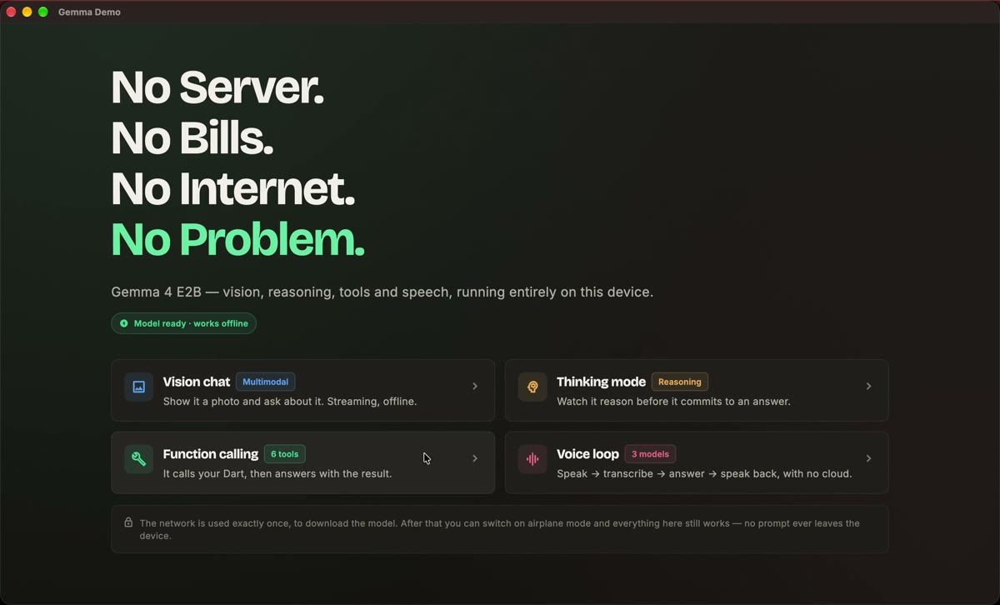
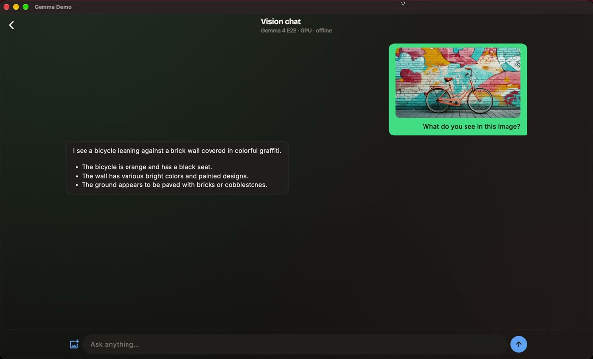
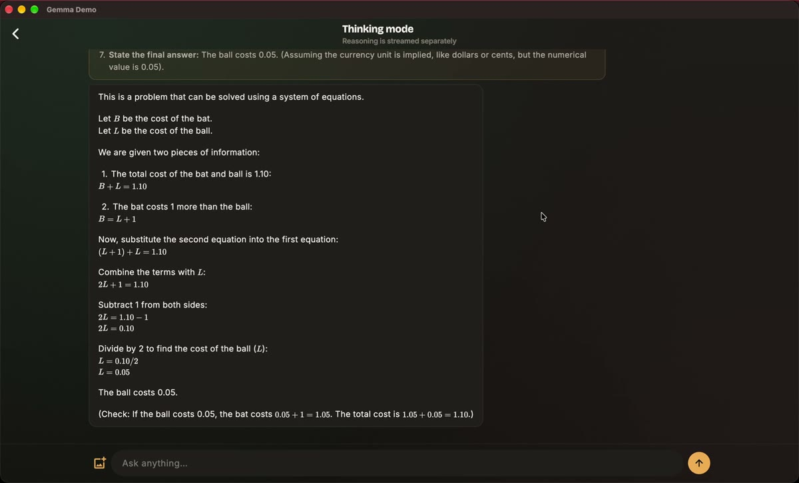
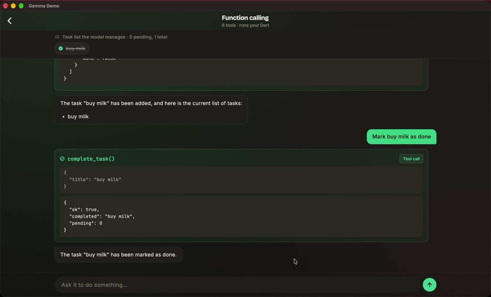
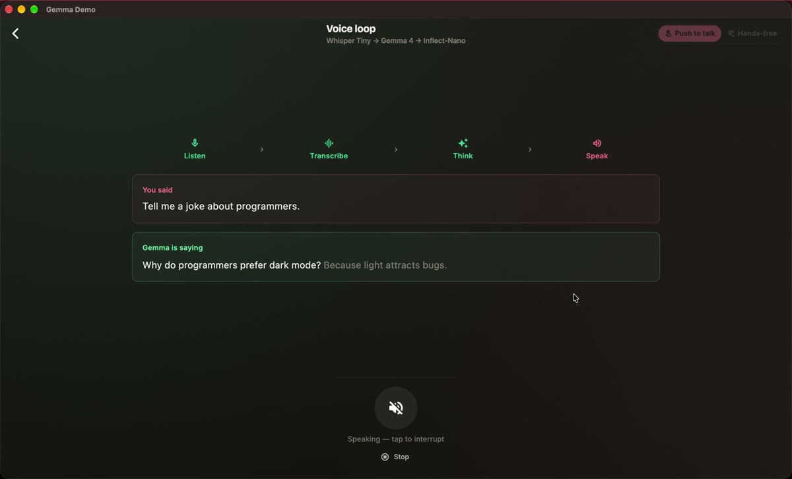

# Gemma On-Device Demo

A Flutter app that runs Gemma 4 E2B on a phone or a Mac. It looks at photos, shows its reasoning, calls Dart functions in the app, and holds a conversation out loud. It uses the network once, to download the model. After that you can switch on airplane mode and nothing changes.

I built it for my talk, **Building On-Device AI Apps with Flutter and Gemma**, on top of [flutter_edge_ai](https://pub.dev/packages/flutter_edge_ai).

Moving an older app across, or wondering where `flutter_gemma` went? That story is in [WHATS_NEW.md](WHATS_NEW.md).

## What's in it

Four screens, one model.

**Vision chat** takes a photo and answers questions about it, streaming as it writes. **Thinking mode** puts the model's reasoning in its own section above the answer, so you can watch it work through a problem before it commits. **Function calling** gives it six tools that change what's on screen — ask it to add a task and then read your list back, and it calls two in a row. **Voice loop** is the one people remember: you speak, it answers out loud, with three models running on the device and no network at any point.

<table>
  <tr>
    <td></td>
    <td></td>
    <td></td>
  </tr>
  <tr>
    <td></td>
    <td></td>
    <td></td>
  </tr>
</table>

## From the talk

- **Slides:** [akanshajain.dev/talks/on-device-ai](https://akanshajain.dev/talks/on-device-ai/)
- **Codelab:** [akanshajain.dev/codelabs/on-device-ai](https://akanshajain.dev/codelabs/on-device-ai/) — builds a smaller version of this app from an empty project
- **Article:** [Why I think on-device AI changes mobile architecture](https://medium.com/flutter-community/why-i-think-on-device-ai-changes-mobile-architecture-3cc6b09afd83)

## Running it

The project pins Flutter 3.47.3 with [FVM](https://fvm.app) so it can't disturb your other projects. flutter_edge_ai needs Flutter 3.44+ and Dart 3.12+.

```bash
dart pub global activate fvm   # if you don't have FVM yet
fvm install                    # installs the version in .fvmrc
fvm flutter pub get
fvm flutter run -d macos       # or pick a connected phone
```

Use `fvm flutter` rather than plain `flutter` — an older SDK will refuse to resolve the dependencies. There's no Hugging Face token to set up; every model here is public.

## The models

| | Model | Download |
| --- | --- | --- |
| Text and images in, answer out | Gemma 4 E2B (`.litertlm`) | 2.6 GB |
| Speech to text | Whisper Tiny | 151 MB |
| Text to speech | Inflect-Nano-v2 | about 36 MB |

Gemma downloads the first time you open any screen and all four share it. The speech models wait until you open the voice loop.

The `.litertlm` format matters more than it sounds: one file covers Android, iOS and macOS, while the older `.task` format is MediaPipe-only and won't load on desktop at all.

Whisper is there because of something I didn't expect. Speech-to-text models are exported with a fixed listening window, and Moonshine Tiny's is five seconds — it's in the filename, `moonshine_tiny_5s_f32.tflite`. Anything past five seconds is thrown away with no error, which looks exactly like a broken app. Whisper gives you thirty, so the recorder caps at 25 and shows a countdown.

Inflect replaced Matcha for speed. On my M1, one 4.8-second sentence took 0.6 s to synthesize with Inflect and 15.8 s with Matcha, and Whisper transcribed both back word-perfect. Inflect is English-only, which the voice loop pins anyway.

## What you need

**Android 11 (API 30) or newer**, arm64, with memory to spare. API 30 is the floor for `.litertlm` inference and speech, and the build is restricted to arm64 so you find out at build time instead of when the engine starts.

**iOS 16 or newer, on a real iPhone.** That's what this project's Podfile declares; flutter_edge_ai itself asks for 15 or newer. The Simulator is CPU-only, so the GPU path you actually want isn't available there.

**macOS on Apple Silicon.** Intel isn't supported by the engine. This is the easiest target to develop against.

Web is out, because the web build of Gemma 4 E2B is text-only and the vision screen would have nothing to do.

## How the code is laid out

```text
lib/
├── main.dart                 starts flutter_edge_ai and registers the engine
├── theme.dart                colours, type and shared styles
├── gemma/
│   ├── model_catalog.dart    every model link and setting in one place
│   ├── gemma_service.dart    loads the model once and opens conversations
│   ├── demo_tools.dart       the tools the model can use, and what they do
│   ├── gemma_failure.dart    turns errors into messages people can act on
│   ├── model_text.dart       cleans up the model's text before it's shown
│   ├── sentence_chunker.dart splits a reply into sentences as it arrives
│   ├── voice_activity_detector.dart  decides when you start and stop talking
│   └── voice_turn.dart       listen, think, speak: one voice turn
├── screens/                  home, model download, chat, tools, voice
├── widgets/                  chat bubbles, message box, voice controls
└── utils/audio_converter.dart  converts between WAV files and raw audio
```

## What caught me out

Two settings have defaults that are wrong for this app, and neither one is a compile error. `installModel` defaults `fileType` to `.task`, so a `.litertlm` file gets handed to an engine that can't read it — you download 2.6 GB and then watch it fail to load. And `createChat` falls back to `ModelType.gemmaIt` if you leave `modelType` out, which quietly turns Gemma 4's native tool calls into text pasted in the prompt. Function calling then looks broken for no visible reason.

Images only work in the main conversation. `createChat()` uses the model's single primary session; `openChat()` gives you extra ones on the same loaded weights, which is what you want when every screen needs its own chat. On the `.litertlm` engine those extra sessions get rebuilt from their history as *text* whenever the engine switches between them, and a photo can't be replayed as text, so they refuse it outright: *"Image/audio input is not supported on concurrent (openSession) `.litertlm` sessions."* Text worked everywhere and the first image failed. The vision screen uses `createChat()`, which is fine here because only one screen is ever open.

A tool that takes no arguments still needs a schema. `Tool.parameters` defaults to an empty map and generation dies with `Failed to start streaming (code: 13)`, which tells you nothing. `get_current_time` carries `{'type': 'object', 'properties': <String, dynamic>{}}` for that reason alone.

The model also leaks its own plumbing occasionally. Tool calls and reasoning come down the same stream as the answer, and although the package separates them, I still saw raw markers reach the screen. `ModelText.sanitize` runs over the whole reply so far rather than each new chunk, because a marker can be split across two of them.

Tools return an `{'error': ...}` map instead of throwing. A thrown exception ends the model's turn; an error map gets read, and the model usually explains itself or tries something else.

Hands-free listening is mine, not the package's — `VoiceActivityDetector` watches the microphone level, starts at −40 dB and stops after about 2.6 seconds of quiet. Air conditioning will set it off, so there's a sensitivity control on the voice screen.

Last one: Google's model card suggests temperature 1.0, topP 0.95, topK 64. At those settings this small model occasionally switched language mid-sentence — an English answer with the Japanese word for "source" dropped into it. Chat runs at 0.7 / 0.9 / 40, voice at 0.3, and the system instruction names the language. It still happens, just rarely.

## Tests

```bash
fvm flutter test
```

116 of them, aimed at the places where a bug hides until it matters: the tools never throw whatever the model sends, WAV and raw audio survive a round trip including malformed input, the sentence splitter doesn't trip on "3.14" or "Dr. Bhatt", the text cleanup runs against real output that leaked, voice detection is checked in quiet and noisy conditions, and the voice loop is driven end to end with fake models to prove every turn finishes instead of hanging.

## Platform setup worth knowing about

On Android 14 and newer, a large foreground download crashes unless the app declares `FOREGROUND_SERVICE_DATA_SYNC` and marks WorkManager's `SystemForegroundService` as a data sync service. Both are in the manifest. The OpenCL entries the GPU needs come from the package's own manifest, so there's nothing to add for those.

macOS needs the `post_install` block in `macos/Podfile`. Two GPU companion libraries can't be bundled automatically, and that block adds the build phase that stages them into the app. Skip it and the build still succeeds — it's the first model load that fails, with `Library not loaded: @rpath/libGemmaModelConstraintProvider.dylib`. The entitlements there also cover loading those libraries, the network, file picking and the microphone.

The iPhone memory entitlements are deliberately absent from the macOS build. They do nothing on a Mac and they make Xcode demand a signing certificate.

## Credits

[flutter_edge_ai](https://github.com/DenisovAV/flutter_edge_ai) by Sasha Denisov ([docs](https://flutteredge.ai)), [Gemma](https://ai.google.dev/gemma) by Google DeepMind, and the model builds from [litert-community](https://huggingface.co/litert-community) on Hugging Face.

## Author

**Akansha Jain** — Senior Software Engineer, Google Women Techmakers Ambassador, Co-organizer of Flutter Conf India and Flutter Delhi.
